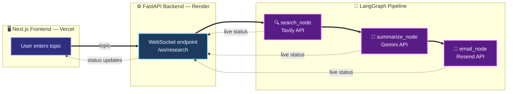

# Nexlore

**AI-powered research agent** — give it a topic, and it searches the web, summarizes the findings with Gemini, and emails you the results, all in real time.

🔗 **Live app:** [nexlore-rust.vercel.app](https://nexlore-rust.vercel.app)
🔗 **API:** [nexlore-backend.onrender.com](https://nexlore-backend.onrender.com)

> Note: the backend runs on a free tier and spins down after inactivity. The first request after idle may take 30–60 seconds to wake up.

<!-- Add a screenshot of the live app here once you have one, e.g.: -->
<!--  -->

---

## What it does

1. You type a topic and hit **Research**
2. A LangGraph agent pipeline kicks off:
   - **Search** — Tavily searches the web for current information
   - **Summarize** — Gemini condenses the results into a clear, readable summary
   - **Email** — the summary is sent to your inbox via Resend
3. You see each stage update live in the UI via a WebSocket connection — no page reloads, no waiting silently

---

## Architecture



---

## Tech stack

| Layer | Technology |
|---|---|
| Frontend | Next.js (App Router), Tailwind CSS |
| Backend | FastAPI, WebSockets |
| Agent orchestration | LangGraph |
| Search | Tavily API |
| LLM | Google Gemini (`gemini-flash-lite-latest`) |
| Email delivery | Resend API |
| Backend hosting | Render |
| Frontend hosting | Vercel |

---

## Why these choices

- **LangGraph** for explicit, inspectable agent orchestration — each step (search, summarize, email) is a discrete node, making the pipeline easy to reason about, test, and extend.
- **WebSockets over plain HTTP** for the live research flow — the user sees real progress (searching → summarizing → emailing) instead of a blank loading spinner during a multi-step, multi-second process.
- **Resend over Gmail SMTP** — Render's free tier blocks outbound SMTP ports (25/465/587) for spam prevention. Resend sends over HTTPS, working reliably on free hosting.
- **Gemini over a paid LLM API** — keeps the entire stack running on free tiers end-to-end, with no billing required to run or fork the project.

---

## Running it locally

### Backend

```bash
cd backend
python -m venv venv
venv\Scripts\Activate.ps1   # Windows
pip install -r requirements.txt
```

Create a `.env` file in `backend/`:
```
GEMINI_API_KEY=your_key
TAVILY_API_KEY=your_key
RESEND_API_KEY=your_key
EMAIL_ADDRESS=your_email
EMAIL_APP_PASSWORD=your_app_password
```

```bash
uvicorn main:app --reload
```

### Frontend

```bash
cd frontend
npm install
npm run dev
```

Visit `http://localhost:3000`.

---

## Project structure

```
nexlore/
├── backend/
│   ├── agents/
│   │   └── graph.py       # LangGraph pipeline: search → summarize → email
│   ├── main.py             # FastAPI app: HTTP + WebSocket endpoints
│   ├── config.py           # Environment variable loading
│   └── requirements.txt
└── frontend/
    └── app/
        ├── layout.tsx       # Root layout, font setup
        └── page.tsx         # Main UI: form, live status, summary display
```

---

## Possible next steps

- Persist research history (per-session or per-user)
- Support multiple recipients / custom email templates
- Add source citations inline with the summary
- Rate limiting on the public API

---

Built by [Devadharshini S](https://github.com/DEVADHARSHINI2021) as a portfolio project.
